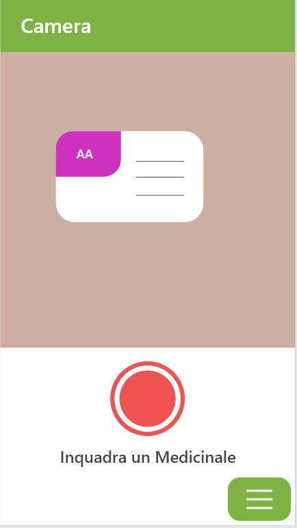
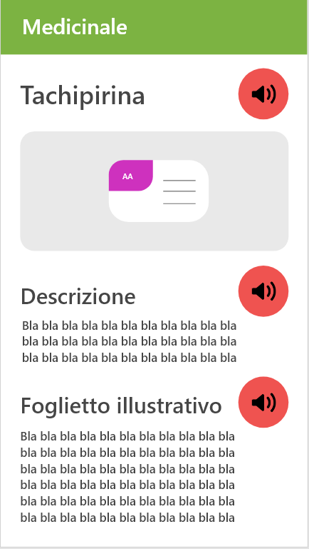
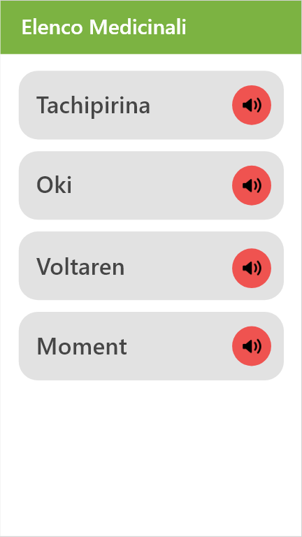
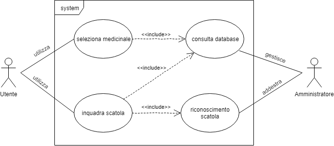

# Titolo
Progetto fine anno degli studenti Rota Nicola e Vedovati Matteo

# Introduzione generale
Il progetto consiste nella creazione di un'applicazione Android per aiutare le persone anziane o in generale le persone che hanno una certa difficoltà visiva a non confondere le proprie medicine. A tale riguardo, quando verrà inquadrato un medicinale, con l’aiuto dell AI, l'applicazione saprà riconoscere il medicinale in questione e presenterà all’utente una scheda descrittiva di quest’ultimo. L’applicazione si presenta quindi anche come un supporto dove consultare foglietti illustrativi e descrizione di codeste medicine in caso di necessità. In tutta l'applicazione sarà comunque sempre possibile ascoltare tutto ciò che si è incapacitati a leggere.

# Tecnologie utilizzate
- Sviluppo Applicazione: Android Studio (Java)
- Sviluppo AI: modello ML in python tramite l'utilizzo di Tensorflow (Keras)
- Sviluppo Database in SQL contenente le informazioni sui medicinali
- Server web in Python per gestire le richieste HTTP al modello
- Script PHP per la gestione di chiamate REST al database

# Prototipo app
<table style="width:100%">
  <tr>
    <th>prima vista</th>
    <th>seconda vista</th> 
    <th>terza vista</th>
  </tr>
  <tr>
    <td></td>
    <td></td> 
    <td></td>
  </tr>
  <tr>
    <td>inquadra scatola medicinale</td>
    <td>seleziona medicinale</td> 
    <td>visualizza scheda medicinale</td>
  </tr>
</table>

Nella prima vista l’utente ha la possibilità di inquadrare un medicinale tramite la camera e schiacciare il pulsante centrale rosso per entrare nella scheda specifica o, tramite il pulsante verde in basso a destra, entrare nell’elenco di tutti i medicinali.

Nella seconda vista si ha possibilità di leggere o ascoltare la scheda del medicinale scelto composta da: nome, immagine, descrizione abbastanza sintetica ed riassunto del foglietto illustrativo sempre del medicinale.

Nella terza vista si ha l’elenco completo dei medicinali presenti nel database e, anche in questo caso, si ha la possibilità di ascoltare tutta la lista tramite apposito pulsante.

# Requisiti
- L’applicazione deve essere interamente navigabile anche alle persone con disabilità visive tramite audio
- Inquadrato un medicinale l'applicazione dovrà aprire la scheda del medicinale stesso
- Deve essere possibile navigare un elenco delle schede di tutti i medicinali

# Casi d'uso

- l’utente inquadra o seleziona una scatola di medicinali
- il sistema riconosce la scatola e mostra all’utente la scheda descrittiva
- l’utente può leggere la scheda o ascoltarla
- l’utente chiude la scheda e può inquadrare un altro medicinale
